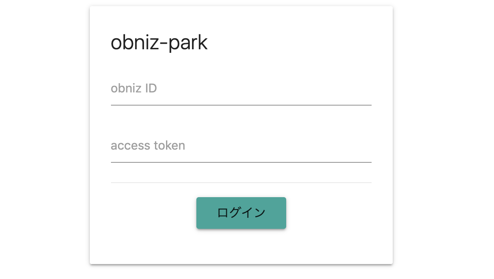
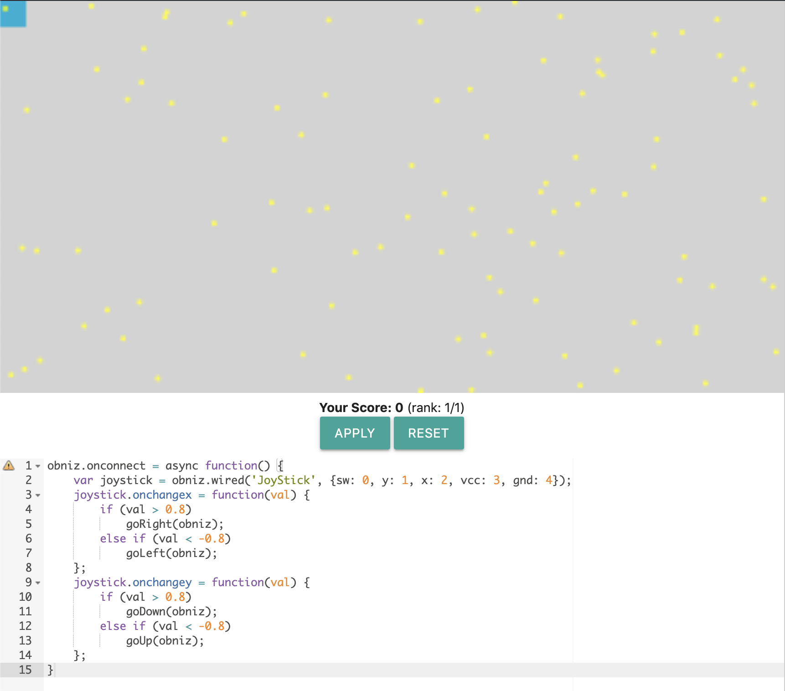

# obniz-park
obnizを使ったログイン機構+オリジナルコントローラ

## screenshots

## overview
対象ユーザはobniz board保有者です．接続可能な状態になっているobniz boardのobniz IDと，設定している場合そのアクセストークンを入力することでログインが可能です．  
ログイン後は，obniz boardをコントローラにしてゲーム([Pac-Man](https://ja.wikipedia.org/wiki/%E3%83%91%E3%83%83%E3%82%AF%E3%83%9E%E3%83%B3)をイメージしました)で遊ぶことが可能です．画面内を移動してエサ(黄色い点)をゲットすることでスコアを獲得できます．  
コントローラは，プレイ画面の下部にエディターがあるので，そこを編集して**自分で作成**します．初期入力は，[ジョイスティック](https://obniz.io/ja/sdk/parts/JoyStick/README.md)をobniz boardに接続してコントローラにする場合のexampleです．exampleのように，`obniz.onconnect = async function(){...}`の中身を書く形で記述してください．  
プレイヤーは以下の5種類のコントロール用関数を使用できます．引数は全て`new Obniz('YOUR_OBNIZ_ID')`で作成された`obniz`オブジェクトです．

関数名|役割
:-:|:-:
`goRight()`|画面上を右に1px移動します
`goLeft()`|画面上を左に1px移動します
`goDown()`|画面上を下に1px移動します
`goUp()`|画面上を上に1px移動します
`reset()`|初期位置(画面左上)に戻ります (獲得スコアもリセットされます)

エディター上部には，スコアおよびランクの表示と，2つのボタンがあります．  
同時にログインしているユーザ同士で，スコアを競うことができます．  
APPLYボタンを押すと，エディターに記述された内容が適用され，正しいコードの場合コントロールすることが可能になります．RESETボタンを押すと，`obniz.onconnect = null`となり，obniz boardが再接続され，自機が初期位置に戻ります．